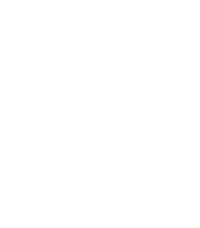

# Past Present Future

<p align="center">
  
</p>

## English

**Past Present Future** is a Pebble Time 2 watchface that refuses to live in
only one moment. The present sits in the middle, the past waits on the left,
and the future is already queuing on the right.

Choose between a clean slide-and-bounce animation or a row-by-row pixel wave,
show the date and current temperature, and use a light, dark, or
shake-to-toggle theme.

The Swiss emblem is not a localization feature. It is my personal signature:
Pebble is American, I am Swiss, so every watchface I make gets a tiny piece of
Switzerland. Consider it wrist-sized horological diplomacy.

## Deutsch

**Past Present Future** ist ein Ziffernblatt für die Pebble Time 2, das sich
weigert, nur in einem einzigen Moment zu leben. In der Mitte steht die
Gegenwart, links wartet die Vergangenheit und rechts drängelt bereits die
Zukunft.

Zur Auswahl stehen eine klare Slide-and-Bounce-Animation und eine zeilenweise
Pixelwelle. Datum und aktuelle Temperatur lassen sich einblenden; beim Design
kann zwischen Hell, Dunkel und Umschalten durch Schütteln gewählt werden.

Das Schweizer Wappen ist keine Lokalisierungsfunktion, sondern meine
persönliche Signatur: Die Pebble ist amerikanisch, ich bin Schweizer – also
bekommt jedes meiner Ziffernblätter ein kleines Stück Schweiz. Quasi
diplomatische Beziehungen fürs Handgelenk.

## Features

- Made specifically for Pebble Time 2 / Emery
- Past, present and future hour and minute at a glance
- Slide-and-Bounce and Pixel-Wave animations
- Light, dark and shake-to-toggle themes
- Optional date and current temperature
- Optional Swiss emblem
- Clay configuration

## Build

```bash
npm install
pebble build
```

Install through the local Pebble development connection:

```bash
pebble install --phone PHONE_IP
```

## Credits

Original project by Chris Lewis.

Pebble Time 2 port, rendering changes, configuration, weather, themes and
additional artwork by marukitano.

## License

MIT. See [LICENSE](LICENSE).
